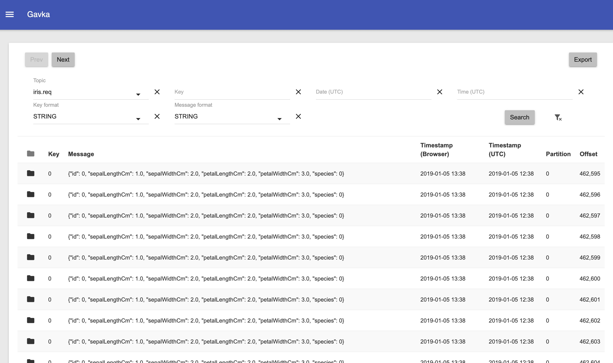

# Gavka #

This project was created by two friends who were constantly under attack by the people, who tried to find out if their message was actually written to Apache Kafka.

Gavka is a web application for browsing Apache Kafka topics. The tool allows

* search messages by key or time
* export topic as a text file
  
Gavka consists of the two war files and can be deployed to any J2EE server. It requires a connection to the running Kafka cluster, which can be configured using environment variables. It is also possible to run Gavka with docker.



### How to Use ###

If you are successfully connected to Kafka Cluster then you can see your topics in the drop down.  Select the topic, select the serialisers and click Search button. You can also filter the messages by timestamp (enter in UTC).

### How to get sources ###

Main repository (hg): https://bitbucket.org/JRS/open-gavka

Mirror on GitHub (git): https://github.com/jresearchsoftware/open-gavka

### How to Build ###

Clone the repository then

`cd pom`

`mvn package`

Three files *api.war*, *gavka.war* and *gavkin.war* can be deployed to tomcat or other server. Two environment variables must be specified

* bootstrap.servers
* schema.registry.url

### How to Run with Docker ###

**Please, pay attention to the API container name. Docker should be able to resolve gavka-api host for the correct work of the client**

If you have an access to running Kafka cluster add the connection parameters to the docker-compose.yml

```yaml
version: "2.0"

services:
    gavka-api: 
        image: gavka/gavka-api:latest
        environment:  
# uncomment if you do not have kafka and want to use mock          
#          - spring.profiles.active=nokafka
# if you have working kafka, put here connection parameters to kafka   
          - bootstrap.servers=172.16.1.1:9092
          - schema.registry.url=http://172.16.1.1:8081
    gavkin-ui:
        depends_on: 
            - gavka-api
        image: gavka/gavkin-ui:latest
    gavka-ui:
        depends_on: 
            - gavka-api
            - gavkin-ui
        image: gavka/gavka-ui:latest
        ports:
            - 90:80
```   
Then you can run it as 
`docker-compose up`

Now you can connect as http://localhost:90

If you do not have running Kafka and just want to run it with the mock services use the following docker-compose.yml :

```yaml
version: "2.0"

services:
    gavka-api: 
        image: gavka/gavka-api:latest
        environment:  
           - spring.profiles.active=nokafka
    gavkin-ui:
        depends_on: 
            - gavka-api
        image: gavka/gavkin-ui:latest
    gavka-ui:
        depends_on: 
            - gavka-api
            - gavkin-ui
        image: gavka/gavka-ui:latest
        ports:
            - 90:80

```   


### Why is this project called Gavka? ###

When we were thinking about the name of the project this dog suggested: Gav! 
